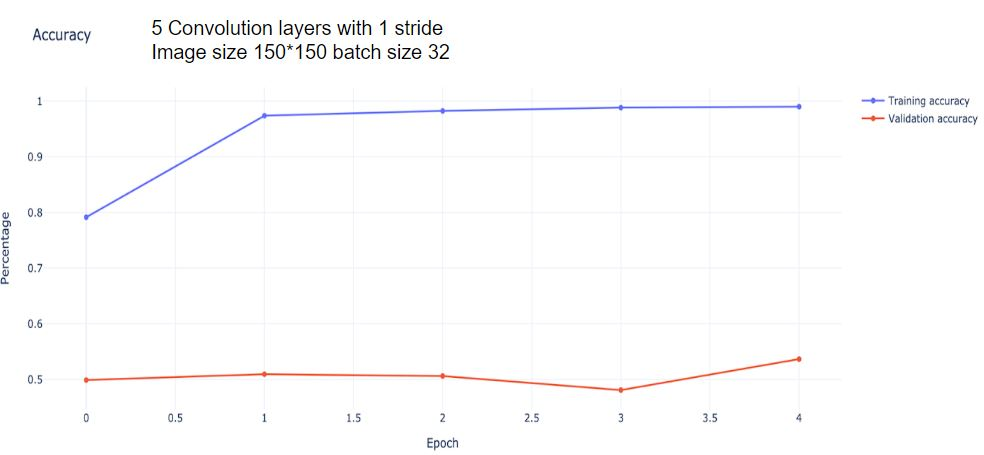
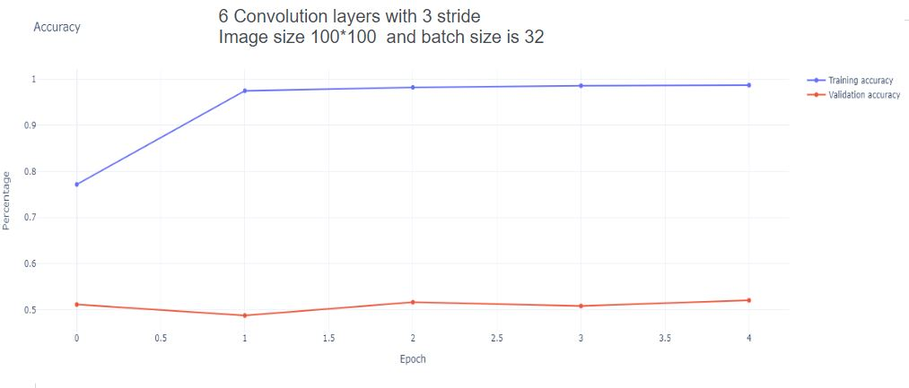

# ML-Pokemon-Image-Classification
This project develops an image classification system using convolutional neural network to predict the pokemon. 

# Progress
This data contains of 150 pokemons with the data source approximately 7000 pictures. Hence, this process will has around 45 pictures per one pokemon kind for training set and test set as 73:27 in order with manually by hand.

I had tried many experiment to get the best accuracy. The results can be inspected as the picture below.

I already tried more than 10 times with different parameters like adjust layers, kernel sizes, image width, and batch size to get the best accuracy but I forgot to capture some of the experiments. Most of them had the accuracy around 30%.

# Conclusion
The best accuracy I had got is approximately 55 percentage. I assumption that reason that my accuracy is not that much because the data sets is very small per one pokemon and also I hadn't tried to use some techniques to make the classification better.

Data source -> https://www.kaggle.com/lantian773030/pokemonclassification

## Developer
Kornphon    Noiprasert  6010545021 

`Note:` This project created a student in Software and Knowledge engineering program, which this project is final project as part of Machine Learning course for second semester of Kasetsart University.